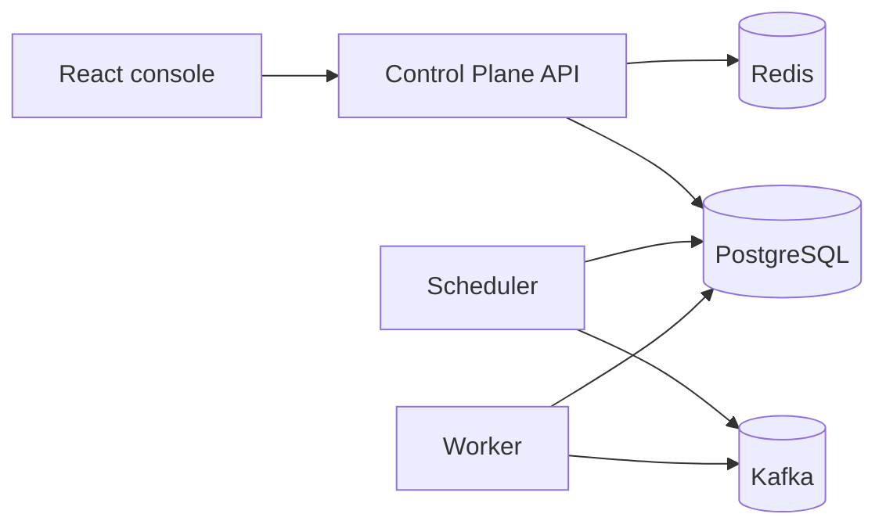

# TaskForge

TaskForge is a distributed workflow orchestration system with a Spring Boot backend, a React workflow console, PostgreSQL for durable state, Kafka for asynchronous execution, and Redis-backed API protection.

It supports defining workflows as directed acyclic graphs, publishing immutable workflow versions, starting workflow runs, dispatching executable tasks to workers, and tracking execution through completion.

## Core Capabilities

- Organization-scoped accounts, JWT authentication, refresh-token rotation, membership, and basic role checks.
- Workflow drafts with editable nodes and edges.
- DAG validation for cycles, duplicate node keys, duplicate edges, self-edges, and missing node references.
- Immutable published workflow versions used by all workflow runs.
- Dependency-aware task execution with fan-out, fan-in, blocked tasks, approvals, and run-level aggregation.
- PostgreSQL-backed transactional outbox, Kafka dispatch, durable worker inbox records, task leases, retries, and dead-letter records.
- Task handlers for no-op, transform, HTTP, approval, and notification-style tasks.
- API keys and schedules for triggering published workflows.
- React workflow console for managing drafts, publishing versions, starting runs, reviewing task status, and handling approvals.
- Local Prometheus/Grafana support and a k6 smoke test for the main workflow path.
- Terraform blueprint for an AWS ECS/Fargate deployment.

## Architecture



PostgreSQL is the source of truth for workflows, runs, tasks, leases, schedules, inbox records, and outbox records. Kafka carries task dispatch events between the scheduler and workers. Redis is used for non-authoritative infrastructure concerns such as rate limiting.

## Tech Stack

- Java, Spring Boot, Maven
- PostgreSQL, Flyway, Kafka, Redis
- React, TypeScript, Vite, TanStack Query
- Docker Compose for local development
- JUnit, Testcontainers, Vitest, React Testing Library, Playwright, k6
- GitHub Actions, CodeQL, Terraform

## Run Locally

```bash
make setup
make up
```

The main services are available at:

- Frontend: <http://localhost:5173>
- API health: <http://localhost:8080/actuator/health>
- Prometheus: <http://localhost:9090> with the observability profile
- Grafana: <http://localhost:3000> with the observability profile

Useful verification commands:

```bash
make test
make lint
make load-test
```

On Windows, the same checks can be run directly:

```powershell
cd backend
.\mvnw.cmd verify

cd ..\frontend
npm.cmd ci
npm.cmd run lint
npm.cmd run typecheck
npm.cmd test -- --run
npm.cmd run build
```

## Repository Layout

- `backend/`: Spring Boot modules for shared domain code, control plane, scheduler, and worker.
- `frontend/`: React/TypeScript workflow console.
- `contracts/`: API and event contract placeholders.
- `docs/`: architecture, roadmap, status, security, testing, deployment, and ADRs.
- `infra/docker/`: local Docker build definitions.
- `infra/observability/`: Prometheus and Grafana configuration.
- `infra/terraform/aws/`: AWS ECS/Fargate deployment blueprint.
- `load-tests/k6/`: smoke-level workflow load test.

## Current Status

The local implementation covers the complete workflow path from authenticated API request through durable workflow state, scheduler dispatch, Kafka delivery, worker execution, and workflow/run status updates.

The AWS infrastructure is a deployment blueprint. It has not been applied to a production AWS account from this repository, so this project does not claim production traffic, uptime, or capacity numbers.

For more detail, see [docs/STATUS.md](docs/STATUS.md), [docs/ARCHITECTURE.md](docs/ARCHITECTURE.md), and [docs/DEPLOYMENT.md](docs/DEPLOYMENT.md).
