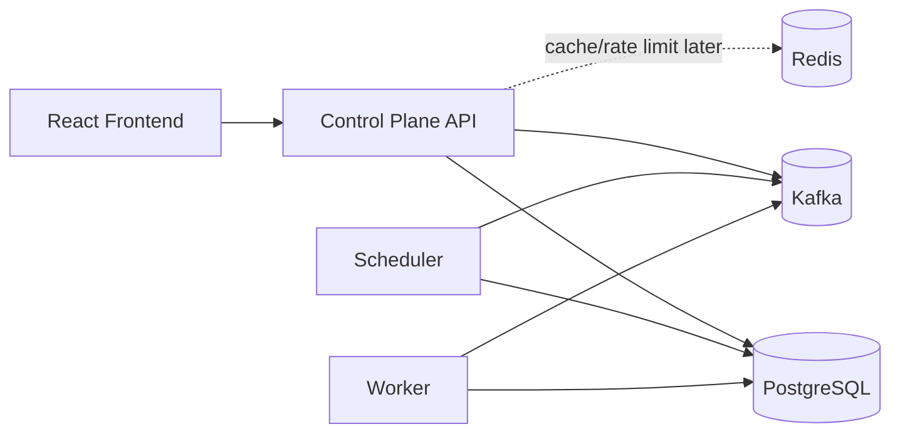

# TaskForge

TaskForge is a multi-tenant distributed workflow orchestration platform. The long-term target is documented in [docs/TASKFORGE_SPEC.md](docs/TASKFORGE_SPEC.md).

This repository currently contains the Phase 0 development foundation only. It intentionally does not implement workflow product features yet.

## Current Foundation

- Java/Spring Boot monorepo backend with shared domain/common modules and three service entry points: control plane, scheduler, and worker.
- React/TypeScript/Vite frontend shell with routing, error boundary, API-client location, tests, linting, and formatting.
- Docker Compose development infrastructure for PostgreSQL, Redis, Kafka in KRaft mode, backend services, and frontend.
- Architecture, security, testing, dependency, roadmap, ADR, and execution-plan documentation.

## Architecture



PostgreSQL is the durable source of truth. Kafka carries asynchronous task-dispatch events. Redis is non-authoritative infrastructure for later caching, idempotency acceleration, and rate limiting.

## Repository Map

- `backend/` - Spring Boot Maven multi-module backend foundation.
- `frontend/` - React/TypeScript frontend foundation.
- `contracts/` - OpenAPI and event contract placeholders.
- `docs/` - specification, architecture, decisions, roadmap, testing, and security documentation.
- `infra/` - Docker, observability, and Terraform placeholders.
- `load-tests/` - k6 load-test location for later phases.
- `.github/workflows/` - CI validation workflow.

## Local Commands

On Unix-like shells:

```bash
make setup
make test
make up
make down
```

On Windows PowerShell, use the underlying commands:

```powershell
cd backend; .\mvnw.cmd verify
cd frontend; npm.cmd ci; npm.cmd run build
docker compose up --build
```

## Status

See [docs/STATUS.md](docs/STATUS.md). No demo credentials, screenshots, measured performance results, or production deployment claims exist yet.

