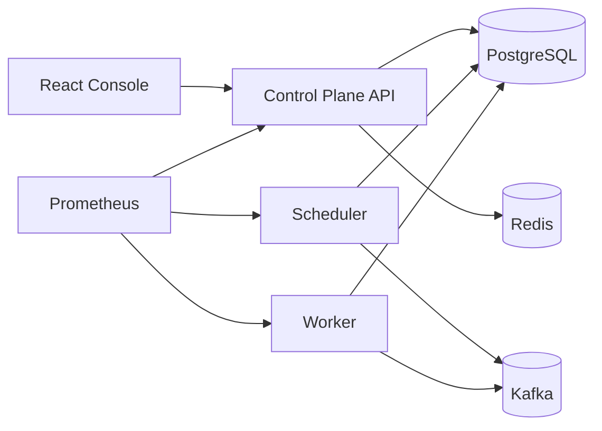

# TaskForge

TaskForge is a multi-tenant distributed workflow orchestration platform built as a portfolio-grade backend, frontend, and cloud-readiness project.

The complete long-term product target remains in [docs/TASKFORGE_SPEC.md](docs/TASKFORGE_SPEC.md). Current implementation status is tracked in [docs/STATUS.md](docs/STATUS.md).

## What It Does

- Creates organization-scoped workflow definitions with editable drafts and immutable published versions.
- Validates DAGs before publication, including duplicate nodes, invalid edges, self-edges, and cycles.
- Starts workflow runs from published versions and executes dependency-aware task graphs.
- Dispatches work through PostgreSQL, a transactional outbox, Kafka, durable inbox records, worker leases, retries, and dead-letter records.
- Supports `NO_OP`, `TRANSFORM`, `HTTP`, `APPROVAL`, and `NOTIFICATION` task foundations.
- Provides a React workflow console for draft editing, validation, publishing, run tracking, task results, approvals, API keys, and schedules.
- Exposes local observability through structured request logs, request correlation IDs, Prometheus, Grafana, and k6 smoke tests.
- Includes an AWS ECS/Fargate Terraform blueprint and hardened GitHub Actions workflows.

## Architecture



PostgreSQL is the durable source of truth. Kafka is the asynchronous transport. Redis is non-authoritative infrastructure for rate limiting and cache-oriented support. Workers are lease-protected and consumers are idempotent.

## Local Development

```bash
make setup
make test
make up
```

Windows PowerShell equivalents:

```powershell
cd backend; .\mvnw.cmd verify
cd frontend; npm.cmd ci; npm.cmd run lint; npm.cmd run typecheck; npm.cmd test -- --run; npm.cmd run build
docker compose up --build
```

Optional observability stack:

```bash
make up-observability
make load-test
```

Open:

- Frontend: <http://localhost:5173>
- Control-plane health: <http://localhost:8080/actuator/health>
- Prometheus: <http://localhost:9090>
- Grafana: <http://localhost:3000>

## Repository Map

- `backend/`: Spring Boot Maven modules for common API/observability, domain, control-plane, scheduler, and worker.
- `frontend/`: React/TypeScript/Vite workflow console.
- `infra/docker/`: local Docker build definitions.
- `infra/observability/`: local Prometheus and Grafana config.
- `infra/terraform/aws/`: AWS ECS/Fargate deployment blueprint.
- `.github/workflows/`: CI, security scanning, and manual deployment workflows.
- `docs/`: architecture, roadmap, security, testing, deployment, ADRs, and portfolio notes.
- `load-tests/k6/`: k6 smoke load script.

## Cloud Readiness

The AWS target is CloudFront/S3 for frontend assets, ALB + ECS Fargate for backend services, RDS PostgreSQL, ElastiCache Redis, managed Kafka/MSK, Secrets Manager, ECR, and CloudWatch.

See [docs/DEPLOYMENT.md](docs/DEPLOYMENT.md) and [infra/terraform/aws/README.md](infra/terraform/aws/README.md).

## Portfolio Notes

See [docs/PORTFOLIO.md](docs/PORTFOLIO.md). Do not claim production throughput, uptime, cost, or resume metrics until measured against a real deployed environment.
