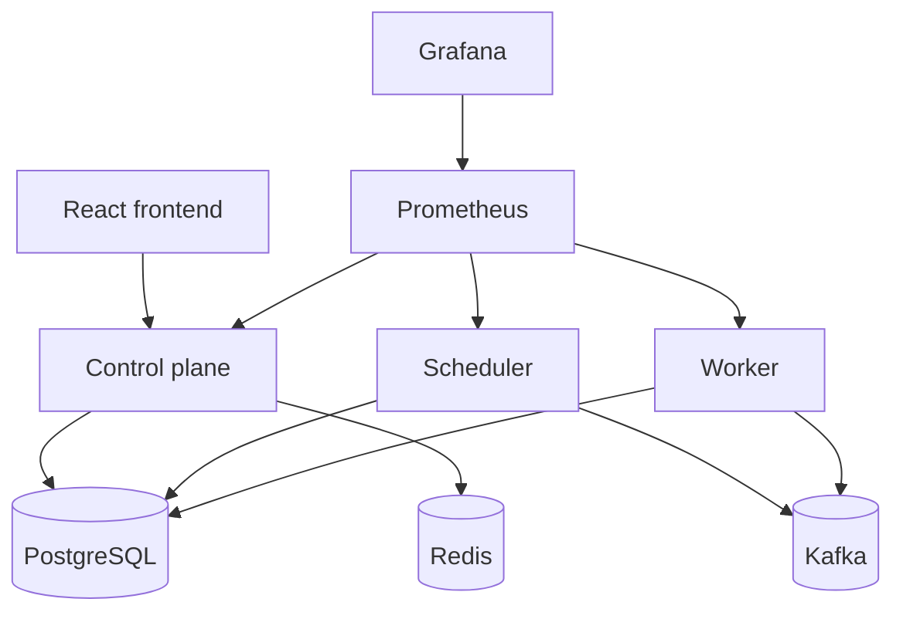
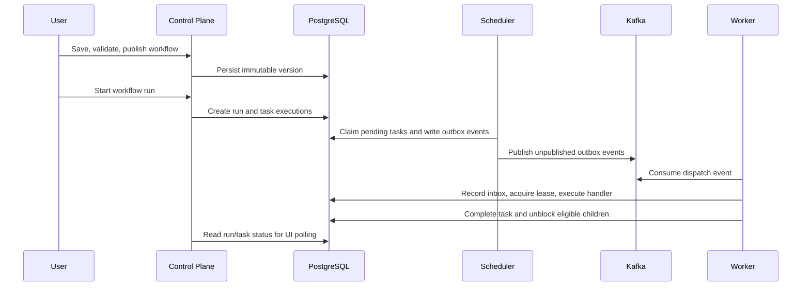
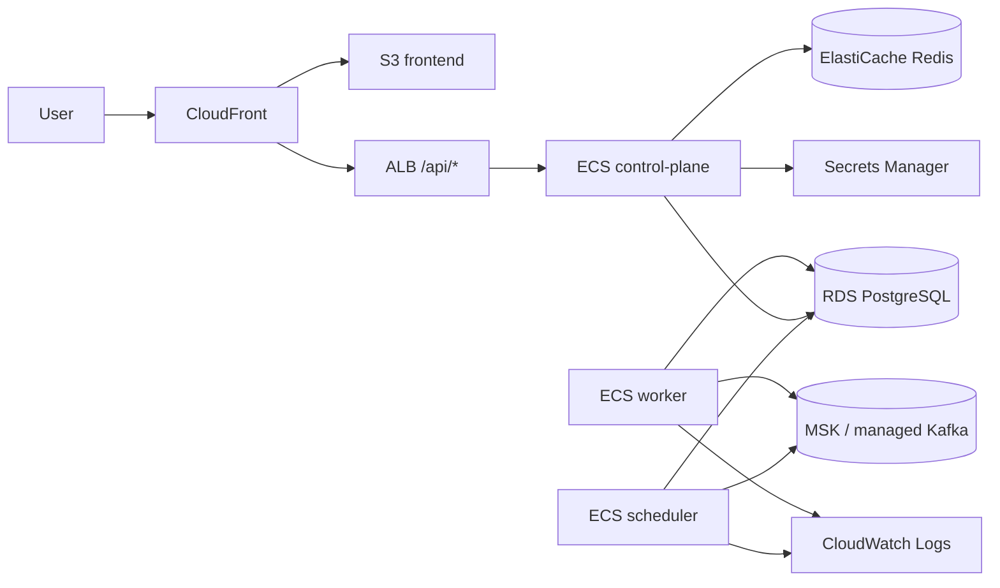

# Architecture

TaskForge is a multi-tenant workflow orchestration platform. The repository implements M0-M7: workflow DAG execution, reliable distributed execution, identity/tenancy, product UI, automation handlers, local observability, and cloud/portfolio readiness.

## Responsibilities

- Control plane: public API, authentication, organization-scoped workflow management, draft/version/run APIs, approvals, API keys, schedules, rate limiting, and dashboard reads.
- Scheduler: transactional outbox publication, due schedule materialization, pending task dispatch, retry timing, and expired lease recovery.
- Worker: Kafka consumption, durable inbox records, task lease acquisition, handler execution, task completion/failure persistence, retry/dead-letter transitions, and workflow progression.

## Local Architecture

## Storage And Messaging

PostgreSQL is the durable source of truth for organizations, users, workflow definitions, workflow versions, runs, task executions, schedules, worker leases, attempts, outbox records, inbox records, and dead-letter records.

Kafka is an asynchronous transport. It does not own business state. Duplicate delivery is expected and handled through durable inbox records plus task lease/state checks.

Redis is non-authoritative infrastructure for rate limiting and future acceleration. Redis loss must not destroy workflow state.

## Frontend/Backend Interaction

The React console calls the control plane over relative `/api/*` URLs. Locally, nginx proxies those calls to the control plane. In the AWS blueprint, CloudFront serves frontend assets from S3 and routes `/api/*` to the public ALB.

## Execution Lifecycle

## AWS Direction

The M7 deployment blueprint targets CloudFront/S3 for frontend assets, CloudFront `/api/*` routing to an ALB, ECS Fargate for control-plane/scheduler/worker, RDS PostgreSQL, ElastiCache Redis, managed Kafka/MSK supplied by bootstrap brokers, Secrets Manager/KMS, ECR, CloudWatch, and future OpenTelemetry export.

## Consistency And Reliability

TaskForge provides at-least-once event delivery, transactional outbox publication, idempotent consumers, durable worker leases, explicit state-transition rules, retry backoff, and dead-letter records. It does not claim exactly-once business processing.

## Security Boundaries

Every tenant-scoped resource is authorized through organization membership. Secrets must be stored in managed secret systems, never committed, and never returned after creation. Logs and task outputs avoid authentication material and HTTP response bodies.
