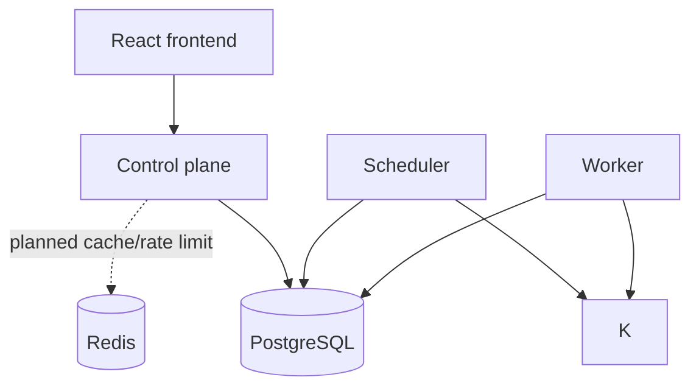
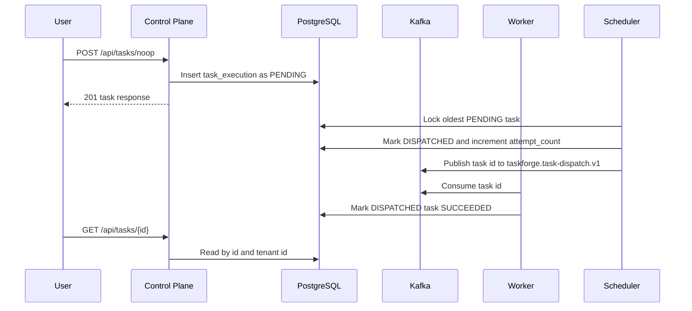

# Architecture

TaskForge will be a multi-tenant workflow orchestration platform. This repository currently implements a Phase 1 vertical slice for one durable no-op task.

## Responsibilities

- Control plane: public API, tenant-scoped task creation/read endpoints, authentication later, organization/workflow ownership later, dashboard reads, and future SSE updates.
- Scheduler: polling-based pending task discovery and Kafka dispatch for Phase 1; future schedule firing, retry timing, lease recovery, and outbox dispatch.
- Worker: Kafka consumption and no-op task completion for Phase 1; future task claiming, lease heartbeats, richer task handlers, and idempotent completion records.

## Local Architecture

## Storage And Messaging

PostgreSQL is the durable source of truth for tenant-scoped workflow state, scheduling state, worker leases, attempts, audit records, idempotency records, outbox records, and inbox records.

Kafka is an asynchronous transport. It does not own business state. Duplicate delivery is expected and must be handled through idempotency. Phase 1 uses topic `taskforge.task-dispatch.v1` with the task id as the message key and value; richer event envelopes are deferred to the reliability phase.

Redis is non-authoritative infrastructure for later caching, rate limiting, and acceleration. Redis loss must not destroy workflow state.

## Frontend/Backend Interaction

The frontend will call the control plane over HTTP. Future live run updates should use SSE because the dominant communication path is server-to-browser status streaming.

## Execution Lifecycle

Implemented Phase 1 lifecycle:

The planned workflow-run lifecycle will add immutable workflow versions, run records, outbox records, durable worker leases, and idempotent inbox records in later phases.

## AWS Direction

The long-term deployment target is CloudFront/S3 for frontend assets, ALB plus ECS Fargate for backend services, RDS PostgreSQL, ElastiCache Redis, MSK or MSK Serverless Kafka, Secrets Manager/KMS, CloudWatch, and OpenTelemetry export.

## Consistency And Reliability

TaskForge will provide at-least-once event delivery, transactional outbox publication, idempotent consumers, durable worker leases, and explicit state-transition rules. It will not claim exactly-once business processing.

Phase 1 has one intentional failure window: scheduler state is written directly to PostgreSQL before Kafka dispatch is durably represented in an outbox table. If the scheduler marks a task `DISPATCHED` and then the process dies before Kafka publish, the task can remain stuck in `DISPATCHED`. If Kafka publish fails synchronously, the scheduler returns the still-dispatched task to `PENDING`; it will not regress a terminal task. Phase 3 is expected to replace this direct publish path with a transactional outbox and idempotent consumer records.

## Security Boundaries

Every tenant-scoped resource must be authorized through organization membership. Secrets must be encrypted at rest and never returned after creation. Logs, traces, and task output must redact secrets and authentication material.
