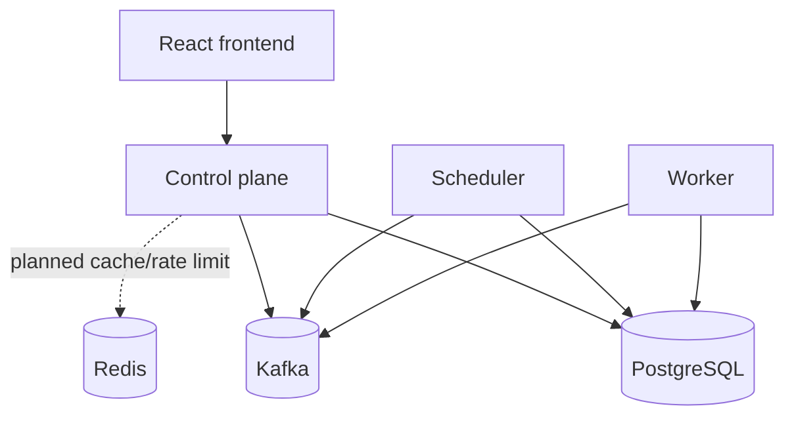
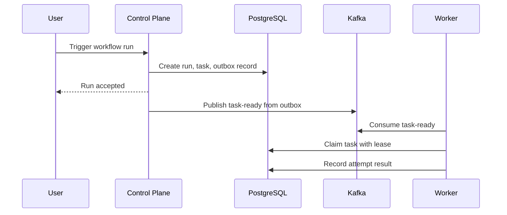

# Architecture

TaskForge will be a multi-tenant workflow orchestration platform. This repository currently implements only the Phase 0 foundation.

## Responsibilities

- Control plane: public API, authentication later, organization/workflow ownership later, dashboard reads, and future SSE updates.
- Scheduler: future schedule firing, due task discovery, retry timing, lease recovery, and outbox dispatch.
- Worker: future Kafka consumption, task claiming, lease heartbeats, task handler execution, and idempotent completion.

## Local Architecture

## Storage And Messaging

PostgreSQL is the durable source of truth for tenant-scoped workflow state, scheduling state, worker leases, attempts, audit records, idempotency records, outbox records, and inbox records.

Kafka is an asynchronous transport. It does not own business state. Duplicate delivery is expected and must be handled through idempotency.

Redis is non-authoritative infrastructure for later caching, rate limiting, and acceleration. Redis loss must not destroy workflow state.

## Frontend/Backend Interaction

The frontend will call the control plane over HTTP. Future live run updates should use SSE because the dominant communication path is server-to-browser status streaming.

## Execution Lifecycle

Planned lifecycle:

## AWS Direction

The long-term deployment target is CloudFront/S3 for frontend assets, ALB plus ECS Fargate for backend services, RDS PostgreSQL, ElastiCache Redis, MSK or MSK Serverless Kafka, Secrets Manager/KMS, CloudWatch, and OpenTelemetry export.

## Consistency And Reliability

TaskForge will provide at-least-once event delivery, transactional outbox publication, idempotent consumers, durable worker leases, and explicit state-transition rules. It will not claim exactly-once business processing.

## Security Boundaries

Every tenant-scoped resource must be authorized through organization membership. Secrets must be encrypted at rest and never returned after creation. Logs, traces, and task output must redact secrets and authentication material.

