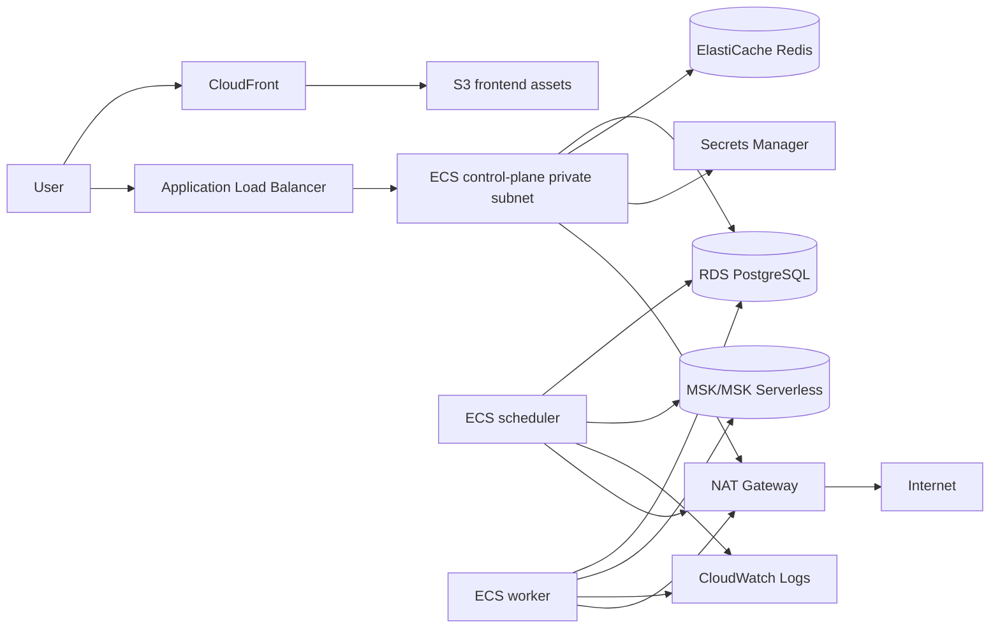

# Deployment

M7 adds a cloud deployment blueprint; it does not claim that a production AWS environment has already been applied.

## Local

```bash
docker compose up --build
docker compose --profile observability up --build
```

## AWS Target

The accepted production direction is ECS Fargate rather than Kubernetes.



## Required Manual Inputs

- AWS account and credentials or GitHub OIDC role.
- Secrets Manager secret for the JWT signing secret.
- Managed Kafka bootstrap brokers.
- Globally unique frontend S3 bucket name.
- DNS/TLS configuration if not using the default CloudFront certificate.

## CI/CD

CI validates backend, frontend, Docker builds, and lightweight security checks. The deploy workflow is manual and requires repository variables/secrets before use:

- `AWS_ROLE_TO_ASSUME`
- `AWS_REGION`
- `ECS_CLUSTER_NAME`
- `FRONTEND_BUCKET_NAME`
- optional `CLOUDFRONT_DISTRIBUTION_ID`
